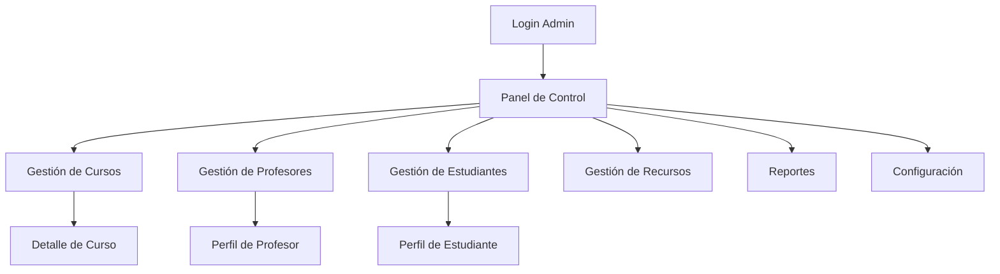

## 1. Product Overview

Panel de Administración para Melody Labs - Academia de música. Permite a los administradores gestionar cursos, profesores, estudiantes y recursos desde una interfaz centralizada.

## 2. Core Features

### 2.1 User Roles

| Role          | Registration Method        | Core Permissions                                |
| ------------- | -------------------------- | ----------------------------------------------- |
| Administrador | Asignado por sistema       | Acceso completo a todas las funciones del panel |
| Estudiante    | Registro público           | Solo acceso a cursos inscritos                  |
| Profesor      | Asignado por administrador | Gestión de sus cursos asignados                 |

### 2.2 Feature Module

Nuestro panel de administración consta de las siguientes páginas principales:

1. **Panel de Control**: tarjetas de resumen, gráficos de estadísticas, actividad reciente.
2. **Gestión de Cursos**: lista de cursos, creación/edición, gestión de estudiantes.
3. **Gestión de Profesores**: lista de profesores, asignación de cursos, información personal.
4. **Gestión de Estudiantes**: lista de estudiantes, progreso académico, estado de pagos.
5. **Gestión de Recursos**: salas e instrumentos, disponibilidad, asignación.
6. **Reportes**: reportes financieros y académicos con filtros personalizables.
7. **Configuración**: ajustes del sistema, preferencias de notificaciones.

### 2.3 Page Details

| Page Name              | Module Name           | Feature description                                                                                                          |
| ---------------------- | --------------------- | ---------------------------------------------------------------------------------------------------------------------------- |
| Panel de Control       | Tarjetas de Resumen   | Mostrar métricas clave: Total Estudiantes, Cursos Activos, Ingresos del Mes, Tasa de Ocupación con indicadores de tendencia. |
| Panel de Control       | Gráficos Estadísticos | Visualización de datos con gráficos de pastel (distribución de cursos) y barras (ingresos mensuales).                        |
| Panel de Control       | Actividad Reciente    | Lista de cursos recientes con información de profesor, estudiantes y estado.                                                 |
| Panel de Control       | Alertas del Sistema   | Notificaciones importantes sobre capacidad máxima, solicitudes pendientes y reportes disponibles.                            |
| Gestión de Cursos      | Tabla de Cursos       | Lista paginable con filtros por nombre, nivel, profesor, estado. Incluye acciones de ver, editar, eliminar.                  |
| Gestión de Cursos      | Nuevo Curso           | Formulario para crear cursos con campos de nombre, descripción, nivel, profesor asignado, cupo máximo.                       |
| Gestión de Profesores  | Tabla de Profesores   | Lista con información de nombre, instrumento, cursos asignados, total de estudiantes.                                        |
| Gestión de Profesores  | Nuevo Profesor        | Formulario de registro con datos personales, especialidad y disponibilidad.                                                  |
| Gestión de Estudiantes | KPI Cards             | Tarjetas con métricas de total estudiantes, pagos al día, pagos pendientes, progreso promedio.                               |
| Gestión de Estudiantes | Tabla de Estudiantes  | Lista con información completa incluyendo cursos inscritos, progreso, estado de pago, fecha de inscripción.                  |
| Gestión de Estudiantes | Búsqueda y Filtros    | Campo de búsqueda por nombre/email y filtros por estado de pago y cursos.                                                    |
| Gestión de Recursos    | Tabla de Recursos     | Gestión de salas e instrumentos con estado de disponibilidad y ocupación actual.                                             |
| Gestión de Recursos    | Editar Recurso        | Modal para actualizar información de recursos y cambiar estado de disponibilidad.                                            |

## 3. Core Process

### Flujo del Administrador

1. Login con credenciales de administrador
2. Acceso al Panel de Control para ver métricas generales
3. Navegación entre secciones mediante sidebar superior con tabs
4. Gestión de cursos: crear, editar, asignar profesores, monitorear cupos
5. Gestión de profesores: registrar, asignar cursos, revisar cargas académicas
6. Gestión de estudiantes: revisar progreso, gestionar inscripciones, monitorear pagos
7. Gestión de recursos: asignar salas e instrumentos a cursos
8. Generación de reportes financieros y académicos

## 4. User Interface Design

### 4.1 Design Style

* **Colores Primarios**: Azul (#4C84FF) para acciones principales y énfasis

* **Colores Secundarios**: Púrpura para estados "Activo/Al día", verde para métricas positivas, gris para estados inactivos/pendientes

* **Estilo de Botones**: Píldoras redondeadas con bordes sutiles, fondo claro para tabs inactivos

* **Tipografía**: Inter o similar, sans-serif redondeada. Títulos medianos, textos pequeños para detalles

* **Estilo de Layout**: Tarjetas con esquinas redondeadas y sombras sutiles, navegación superior en píldoras

* **Iconos**: Estilo outline minimalista, colores en círculos pequeños para identificación visual

### 4.2 Page Design Overview

| Page Name              | Module Name         | UI Elements                                                                                                                                      |
| ---------------------- | ------------------- | ------------------------------------------------------------------------------------------------------------------------------------------------ |
| Panel de Control       | Tarjetas de Resumen | Diseño de 4 columnas en desktop, cada tarjeta con icono circular a la izquierda, valor principal destacado, subtítulo con indicador de tendencia |
| Panel de Control       | Gráficos            | Contenedores de aspecto 16:9 con placeholder para gráficos, títulos sobre cada gráfico                                                           |
| Panel de Control       | Tablas              | Filas con zebra stripes, bordes finos, iconos de acción pequeños en gris                                                                         |
| Gestión de Cursos      | Tabla               | Encabezados gris claro, badges de nivel con colores diferenciados, pills de estado con fondo coloreado y texto blanco                            |
| Gestión de Estudiantes | Progress Bars       | Barras de progreso coloridas con porcentaje numérico, pills de estado de pago con colores según situación                                        |

### 4.3 Responsiveness

* Diseño desktop-first con adaptación mobile

* Sidebar superior se convierte en menú hamburguesa en móviles

* Tarjetas de resumen se apilan verticalmente en pantallas pequeñas

* Tablas con scroll horizontal en dispositivos móviles

* Botón de ayuda flotante siempre visible en

