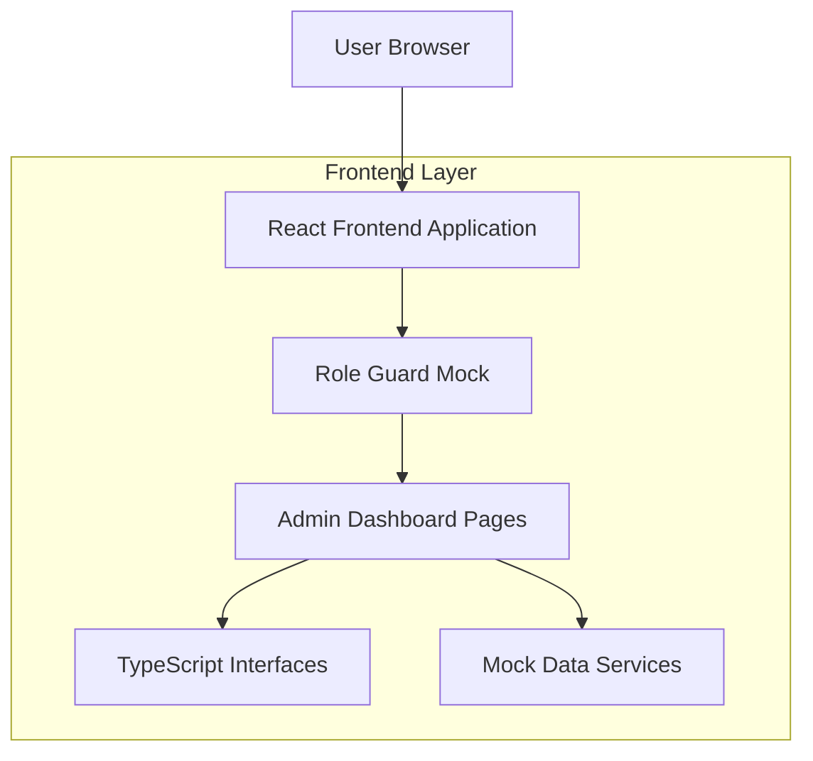

## 1. Architecture design



## 2. Technology Description
- Frontend: React@18 + tailwindcss@3 + vite
- Initialization Tool: vite-init
- Backend: None (mock data only)
- TypeScript: Para tipado estático y mejores interfaces

## 3. Route definitions
| Route | Purpose |
|-------|---------|
| /admin/dashboard | Panel de control principal con métricas y estadísticas |
| /admin/courses | Gestión de cursos con tabla y acciones CRUD |
| /admin/teachers | Gestión de profesores con información y cursos asignados |
| /admin/students | Gestión de estudiantes con progreso y estado de pagos |
| /admin/resources | Gestión de salas e instrumentos con disponibilidad |
| /admin/reports | Reportes financieros y académicos |
| /admin/settings | Configuración del sistema y preferencias |

## 4. API definitions
### 4.1 TypeScript Interfaces

```typescript
// src/types/admin.ts
export interface DashboardStats {
  totalStudents: number;
  activeCourses: number;
  monthlyRevenue: number;
  occupancyRate: number;
  studentGrowth: number;
  courseGrowth: number;
  revenueGrowth: number;
}

export interface Course {
  id: string;
  name: string;
  level: 'Básico' | 'Intermedio' | 'Avanzado';
  teacher: string;
  enrolledStudents: number;
  maxCapacity: number;
  status: 'Lleno' | 'Activo' | 'Inactivo';
}

export interface Teacher {
  id: string;
  name: string;
  instrument: string;
  coursesCount: number;
  totalStudents: number;
}

export interface Student {
  id: string;
  name: string;
  email: string;
  enrolledCourses: string[];
  progress: number;
  paymentStatus: 'Al día' | 'Pendiente' | 'Vencido';
  enrollmentDate: string;
}

export interface Resource {
  id: string;
  type: 'Sala' | 'Instrumento';
  name: string;
  status: 'Ocupado' | 'Disponible';
  occupiedBy: string | null;
}

export interface Alert {
  id: string;
  type: 'warning' | 'info';
  message: string;
  timestamp: string;
}
```

### 4.2 Mock Data Services

```typescript
// src/mocks/admin-data.ts
export const mockDashboardStats: DashboardStats = {
  totalStudents: 127,
  activeCourses: 18,
  monthlyRevenue: 45.2,
  occupancyRate: 78,
  studentGrowth: 12,
  courseGrowth: 0,
  revenueGrowth: 6.5
};

export const mockCourses: Course[] = [
  {
    id: '1',
    name: 'Piano Básico',
    level: 'Básico',
    teacher: 'María González',
    enrolledStudents: 12,
    maxCapacity: 12,
    status: 'Lleno'
  },
  {
    id: '2',
    name: 'Guitarra Intermedia',
    level: 'Intermedio',
    teacher: 'Carlos Ramírez',
    enrolledStudents: 7,
    maxCapacity: 10,
    status: 'Activo'
  }
];

export const mockTeachers: Teacher[] = [
  {
    id: '1',
    name: 'María González',
    instrument: 'Piano',
    coursesCount: 2,
    totalStudents: 20
  },
  {
    id: '2',
    name: 'Carlos Ramírez',
    instrument: 'Guitarra',
    coursesCount: 1,
    totalStudents: 7
  }
];

export const mockStudents: Student[] = [
  {
    id: '1',
    name: 'Laura Martínez',
    email: 'laura.martinez@email.com',
    enrolledCourses: ['Piano Básico', 'Teoría Musical'],
    progress: 75,
    paymentStatus: 'Al día',
    enrollmentDate: '14 ene 2024'
  }
];

export const mockAlerts: Alert[] = [
  {
    id: '1',
    type: 'warning',
    message: '2 cursos alcanzaron su capacidad máxima',
    timestamp: '2024-01-15T10:30:00Z'
  },
  {
    id: '2',
    type: 'info',
    message: '5 nuevas solicitudes de inscripción pendientes',
    timestamp: '2024-01-15T09:15:00Z'
  }
];
```

## 5. Server architecture diagram
No aplica - Arquitectura frontend únicamente con datos mock.

## 6. Data model
No aplica - No hay base de datos, solo interfaces TypeScript y datos mock en memoria.